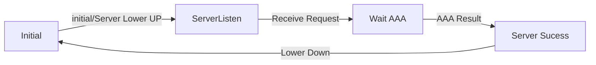
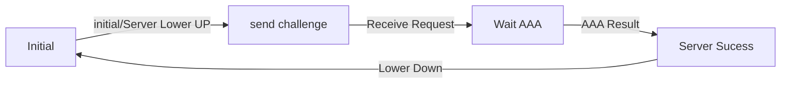

# 网络实验考试预习
## 1.NAT 组网及分析

``` shell

#配置地址池
[R1] nat address-group 1 
[R1-address-group-1] address 192.168.5.105 192.168.5.109
#配置规则地址
[R1]acl number 2001
#注意这里的地址要关联到主机所在的子网，同时按可变为置1就可以
[R1-acl-2001]rule 0 permit/deny source 10.0.0.0 0.0.0.255 
#将规则关联到出口上
[R1] inter e0/1
[R1-Ethernet0/1] nat outbound 2001 address-group 1
```
## 2.端口聚合和生成树协议

``` shell
#端口聚合
[S1] inter Bridge-Aggregation 1
[S1-Bridge-Aggregation 1] link-aggregation mode dynamic
#将需要聚合的端口添在规则上
[S1]inter E1/0/1
[S1-Ethernet 1/0/1]prot link-aggregation group 1

#生成树协议
[S1] stp enable 
[S1] stp disable

#一般在两路端口聚合后，其为两交换机相接的情况，此时需要为聚合路线添加trunk
[S1] inter Bridge-Aggregation 1
[S1-Bridge-Aggregation1]port link-type trunk
[S1-Bridge-Aggregation1]port trunk permit vlan all
```

## 3.VLAN 配置
### 3.1 VLAN的配置命令----不解释，太简单
### 3.2 VLAN端口分类
-  Access端口
指连接`不支持`VLAN技术的`终端设备`的端口
- Trunk端口
指连接`支持`VLAN技术的`网络设备`的端口，只允许默认VLAN不带标签
- Hybrid端口
指Access和Trunk的混合模式，可以对某个VLAN自行设置是否需要标签

## 4.PPP协议
PPP点对点协议是用来保证无差错接受
```shell
[R1]inter Se1/0
[R1-Serial1/0]link-protocol ppp
[R1-Serial1/0]shutdown
[R1-Serial1/0]undo shutdown
```

### 4.1 PAP的验证过程
- 验证方和被验证方，当被验证方拨通验证方时，会将用户名和口令一起发给验证方
- 验证方会根据本地的用户数据库查看是否有此用户，口令是否正确。
- 如果正确给对端发送`ACK`报文，否则发送`NAK`报文

Attention:当验证失败达到一定次数是，才会关闭链路
要重启路由器端口使其PAP验证起作用



### 4.2 CHAP验证方式
询问握手认证协议
> 验证方向被验证方发送一些随机产生的报文

>被验证方接收到对端发送的验证请求（challenge），根据内容查找用户名和口令

>查询后利用随机报文，用户秘钥，报文ID用MD5生成(Response) 

> 验证方接收到该应答以后，利用对端的用户名在本端的数据库查询口令和报文的ID并返回ACK或者NAk


## 5.OSPF协议
### 5.1 ipv4的ospf配置流程

``` shell
#以router为例
[R1] router id 1.1.1.1
[R1] ospf
#划分区域
[R1-ospf-1] area 0
#划分属于area 0 的网段
[R1-ospf-1-area-0.0.0.0]network 1.1.1.0 0.0.0.255
[R1-ospf-1-area-0.0.0.0]network 168.1.1.0 0.0.0.255
#引入直连路由
[R1-ospf-1]import-route direct
#引入静态路由
[R1-ospf-1]import-route static 
```
## 5.2 OSPF 5种报文类型
- Hello报文 周期发送 包括定时器和DR，BDR，以及已知的邻居。
- DD报文 交换邻居路由器之间链路状态数据库的摘要信息，分为空DD报文和非空DD报文，空DD报文用来确定Master/Slave关系。然后才用带信息的报文来传递信息
- LSR报文 比较本地数据库后确定本地LSDB缺少的LSA和需要更新的LSA需要发送LSR来想对方请求LSA
- LSU报文 用来向发送LSR报文的路由器发送其所需的LSA，报文内容是多条LSA的集合
- LSAck报文 对LSU报文进行确认。报文的内容是需要确认的LSA的首部。

## 5.3 OSPF报文交互过程
### 5.3.1 hello 报文发现
- RT1 发送组播地址为224.0.0.5的空hello报文
- RT2 收到RT1 的hello后，为RT1 创建一个邻居数据结构。回复一个hello报文，并写入RT1 的id。设置RT1 的状态为`init`
- RT1 收到RT2的报文后，为RT2创建一个邻居数据结构。状态为`ExStart` 
- 下一步双方开始交换各自的链路状态数据库的信息

### 5.3.2 DD报文的主从关系协商
- RT1 发送空的DD报文，宣称自己是`master` 规定初始序列号为x
- RT2 收到RT1的DD报文，将RT1的邻居状态机改为`ExStart`，回应一个空的DD报文。由于RT2 的Router id较大，将设置自己为`Master` 规定初始序列号为y。
- RT1 收到RT2 的DD报文后，比较Router id 后，同意RT2为`Master` 并将RT2 的状态改为`Exchange`。

### 5.3.4 DD报文交换
- RT1用RT2 规定的序列号y来发送新的DD报文，在报文中设置MS=0说明自己是`Slave`，并且开始携带RT1的LSDB中的LSA的摘要。
- RT2 收到报文后，将RT1的邻居状态机改为`Exchange`,在发送新的DD报文时也携带RT2的LSDB中的LSA的摘要。将序号改为y+1
- DD报文交换持续，直到RT2的一个报文中将M设置为0，表示为最后一个报文。
- RT1 收到最后一个DD报文后，发现RT2中有很多的LSA是自己没有，将邻居状态机的状态改为`Loading`。RT2收到RT1的最后一个DD报文，但RT1的LSA，RT2都已经有了，不需要在请求，直接将RT1的状态改为`Full`。

## 5.4 LSA种类
| Type | LSA|
|:-------:| :---------:|
| 1        | Router |
| 2        | Network |
| 3        | Summary Network|
|4         |Summary ASBR |
|5         |External|

## 6 IPV6 实验
### 6.1 IPv6基本配置
```shell
#以S1为例
[S1] ipv6
[S1] inter vlan2
[S1-vlan-interface 2]ipv6 add 2001::1/64

#window7设置ipv6
#直接在设置里设置ipv6的地址和网关

#ipv6静态路由的设置
[R1]ipv6 route-static 2001:: 64 2007::1 
```
### 6.2 ospfv3 

```shell
[R1] ospfv3 1
[R1-ospfv3-1]router-id 1.1.1.1 #特别注意这里的router-id
[R1]inter e 0/0
#注意这里直接在端口里配置ospfv3 和ipv4有巨大差别
[R1-Ethernet0/0]ospfv3 1 area 0 
```

